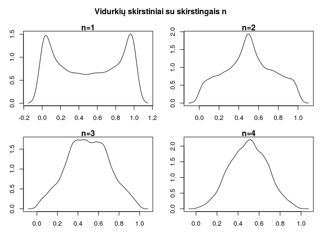

Statistikoje, viena svarbiausių teoremų yra Centrinė ribinė teorema
(CRT). Nežinančiam skaitytojui reiktų patikslinti, kad tai ne viena
teorema - greičiau, tai visa tyrimų kryptis. Egzistuoja daug teiginių ir
jų variacijų - pradinį įspūdi apie tai galima susidaryti paskaičius
[wikipedios
puslapį.](https://en.wikipedia.org/wiki/Central_limit_theorem)

CRT esmė yra ta, kad jei turima daug atsitiktinių dydžių, tai jų sumos
(ir vidurkio) skirstinys panašėja į normalųjį skirstinį. Savaime
suprantama, kad atsitiktiniai dydžiai turi tenkinti tam tikras sąlygas.
Klasikiniu atveju jos yra labai bendros -- užtenka, kad atsitiktiniai
dydžiai būtų nepriklausomi, su vienodu vidurkiu ir baigtine dispersija.

Labai svarbi savybė yra tai, kad CRT galioja visiems skirstiniams,
kuriems tenkinamos šios sąlygos -- tai labai benda (ir galinga) savybė,
kurią ir iliustruosime šiame tinklaraščio įraše.

### Formalus teiginys {#formalus-teiginys}

Lindeberg–Lévy CLT. Tarkime {*X*1, *X*2, ...}
nepriklausomų atsitiktinių dydžių seka su vidurkiu
*E*[*X**i*] = *μ* ir
*V**a**r*[*X**i*] = *σ*2 \< ∞. Kuomet *n* artėja į
begalybę, tuomet

$$\\sqrt{n}\\bigg(\\bigg(\\frac{1}{n}\\sum\_{i=1}^n X\_i\\bigg) - \\mu\\bigg)\\ \\xrightarrow{d}\\ N(0,\\;\\sigma^2).$$

Šlatinis:
[wikipedia.org](https://en.wikipedia.org/wiki/Central_limit_theorem)

Suprasti formalų teiginy gali būti gan kėblu, nes reikia gerai suprasti
ką reiškia artėjimas pagal pasiskirstymą. Iš kitos pusės šio teiginio
intuicija suvokti nėra sunku: kuo didesnis *n*, tuo labiau vidurkio (ir
sumos) skirstinys artėją į normalųjį.

### Iliustracija {#iliustracija}

Norint pademonstruoti CRT veikimą pasirinkime betkokį atsitiktinį dydį,
tenkinanti sąlygas (t.y. užtenka, kad egzistuotų dispersiją). Kad būtų
įdomiau, pasirinkime tokį dydį, kuris visiškai neprimena normaliojo
skirstinio. Tokiai įliustracijai neblogai tiktų
[Beta](https://en.wikipedia.org/wiki/Beta_distribution) skirstinys su
parametrais *α* = *β* = 0.5. Pasižūrėkime, kaip jis atrodo:

~~~~ r
curve(dbeta(x, 0.5, 0.5), main="Beta skirstinio tankis", ylab="", lwd=2, col=4)
~~~~

Iš tiesų, šio skirstinio forma labai stipriai skiriai nuo normaliojo
skirstinio formos. CTR teigia, kad nepaisant skirstionio, atsitiktinių
dydžių skirstinys vis tiek turėtų supanašėti į normalųjį. Iš pradžių,
pasižiūrėkime, kaip kinta vidurkio skirstinys, kai *n* = 1, 2, 3, 4. Tam
panaudosime Monte-Carlo(MC) modeliavimą.

~~~~ r
meanMC <- function(n) mean(rbeta(n, 0.5, 0.5))
op <- par(mfrow = c(2, 2), mar=c(3,3,1,1), oma=c(0,0,3,1))
sim = replicate(10000, meanMC(1))
plot(density(sim), main="n=1", xlab="x", ylab="Tankis")
sim = replicate(10000, meanMC(2))
plot(density(sim), main="n=2", xlab="x", ylab="Tankis")
sim = replicate(10000, meanMC(3))
plot(density(sim), main="n=3", xlab="x", ylab="Tankis")
sim = replicate(10000, meanMC(4))
plot(density(sim), main="n=4", xlab="x", ylab="Tankis")
mtext("Vidurkių skirstiniai su skirstingais n", side=3, line=1, 
      outer=TRUE, cex=1, font=2)
par(op)
~~~~

Galime pastebėti, kad net su nedideliais *n* vidurkis daug labiau
primena normalųjį skirstinį, nei pradinį Beta skirstinį. Pasižiųrėkime,
kaip atdoro vidurkio skirstinys, kai *n* = 100. Taip pat palyginkime tai
su normaliuoju skirstiniu.

~~~~ r
sim = replicate(10000, meanMC(100))
plot(density(sim), main="Vidurkio skirstinys, kai n=100", xlab="x", ylab="Tankis", 
     lwd=2, xlim=c(0.3, 0.65))
curve(dnorm(x, mean=mean(sim), sd=sd(sim)), add=TRUE, col=2, lwd=2, lty=2 )
legend("topleft", c("MC tankis", "Normalusis tankis"), 
       lwd=2, col = 1:2, 
       inset = .05, bg = "gray90")
~~~~

Kaip matome, dabar skirstinių panašumas tampa labai ryškus -- tiksliai
taip, kad ir numato CRT. Tai tik maža iliustracija iliustruojant svarbią
savybę, kad nepriklausomų atsitiktinių dydžių sumos skirstinys panašėja
į normalųjį.

Tikiuosi jums patiko ir kažką naudingo sužinojote. Jei turite įspūdžių
ar pastabų -- prašau prašykite komentarą.
