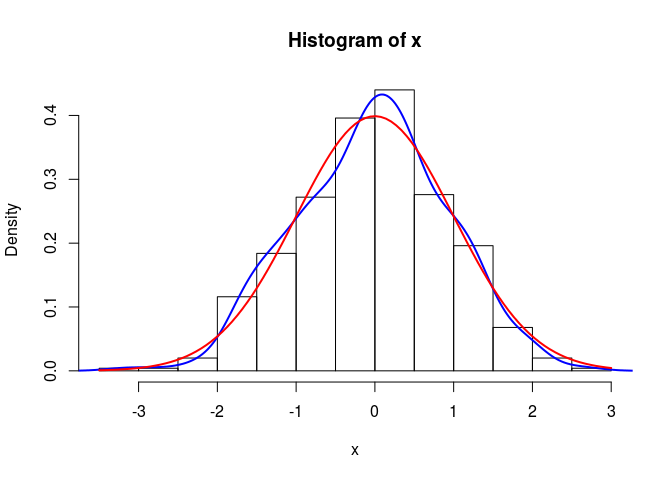

# Practical Econometrics 2
Vygantas Butkus  


Introductory Notes
====================================

This is not a textbook and it is not intend to be. 
Rather, it is short summary that emphases messages of lectures, 
gives corresponding references and reminds tasks (if any). 
During the course this note will be updated regularly.


### Students assesments

The final score are going to be estimated according a formula given below. 
Give your self a time to understand it: 


```r
round(sum(min(6, sum(tasks, midExam, extraPoints)), goldenPoints, finalExam))
```

The variables are explained in more details:

* `tasks`: during the course you are going to have quite a number of tasks. 
I believe this is the main part of the course. The maximum sum of points is 4, but
please note, that huge (unlimited) number of extra points can be received, 
if you demonstrate extra efforts in the tasks. In addition, please note that the `tasks` 
variable can be positive only if you supplied all the tasks that was required. 
If at least on of obligatory tasks are missing, the sum of total points are going to be 0.
Thus, do all the tasks, event if the deadline is far over.
* `midExam`: in the middle of semester you are going to have mid exam. The possible outcome is 2 points.
* `extraPoints`: extra points are going to serve as system of encouraging. You can get extra points in many situations: 
taking challenges, answering unexpected question in lecture, giving good question and so on. 
Please note, that `extraPoints` can be negative as well. This could happen in the case of cheating (or something).
* `goldenPoints`: golden points are very similar to extra points, but to get those, 
you will have to put extra efforts in it. How to get them will be steaded in course.
* `finalExam` after the semester you are going to have final exam. The total points of the exam is 4.

**Cultural aspects of the course:**

1. During the course students are encourage to collaborate with each other. 
You can freely share thought, ideas and event source codes. 
In addition students can use all the material that can be found in the Internet or textbooks.
Using the materials made by others are absolutely legal and have no negative side effect on your assesment.
But there are two conditions that are strictly mandatory:
  * You have to give all the credits to original source. 
  Please write an explicit note with links and give some comments. 
  * You have to make sure you understand all the details of the code (or ideas) that you are using. 
  You can be asked to comment it in great details. So, please use the material that you fully understand.


2. I am promise to do my best in answering all your question. You can ask freely during the lectures.
Nevertheless, in practical assignments, your tasks is to try to find the answer by your self. 
So, in practical tasks, before asking any question please be prepare to report that 
efforts you have made to get the answer?
For example: what has the Google query that you have used? That function you have already tried to apply?  


3. Reading and assessing other students rapports is an important part of your learning. 
Please be honest to your colleagues and give the best insights. On the other hand, 
you should appreciate all the criticism that you get and accept it as important part of your learning.

4. Any initiative and communication is highly encouraged. 
Thus, If you have any ideas how to make course more productive or interesting, please let me know. 

5. The tasks are always open for deeper analysis. If you
have idea how to reveal topic in more detail please do it - it probably will get you some extra points.
On the other hand, if you are not satisfied with the assignment that you get, 
you are free to give your reasons and negotiate. 
 

### Outline of the course

1. A short intro of the stuff that you already should know (at least most of it):
  * Technical tools: R (RStudio), Rmd files, Git
  * The basic properties and concepts  in statistics
  * Linear regression (with some extensions)

2. Linear regression in the content of time series
  * Basics (concepts, the difference with classical regression)
  * Trends (stochastic vs deterministic)
  * Spurious regression
  * Autoregressive model
  * Transformations  

3. Intro in time series
  * Basics: stationarity, autocorrelation, AIF, PAIF
  * The decomposition of time series 
  * Some common methods: exponential smoothing, moving average, filtering
  * Overview of more advanced methods: HP, Kalman, State Space

4. ARIMA model
  * AR(p)
  * MA(q)
  * RW
  * ARIMA: specification, diagnostic, estimation.
  
5. Overview of other important models:
  * Garch
  * logit

### Learning material

Selected textbooks that can be useful in this course could be found in `literature` folder.
In addition, all references are given at the end o this document.


Moreover, some wonderful online material is available:

* Using R for Introductory Econometrics: http://www.urfie.net/ 
* Forecasting: principles and practice: https://www.otexts.org/fpp 
* Introduction to Probability, Statistics, and Random Processes: https://www.probabilitycourse.com/ 


Chapter 1. Technical tools
=====================================

## Technical requirements

In the course you are going to use tree main software:

* R - environment for statistical computing and graphics
* RStudio - a set of integrated tools designed to help you be more productive with R.
* Git - distributed version control system 


I assume you already know R and how to install it. If not check the links below:

* [Installing R on Windows](https://www.youtube.com/watch?v=mfGFv-iB724&feature=youtu.be)
* [Installing R on Mac](https://www.youtube.com/watch?v=Icawuhf0Yqo&feature=youtu.be)
* [Installing R on Ubuntu (linux) ](https://www.youtube.com/watch?v=P8wx4HY9me0)

In addition to R, it’s highly recommended that you install RStudio, 
which will make your experience with R much more enjoyable.
If you need to install RStudio, you can do so [here](https://www.rstudio.com/products/rstudio/download/).
Select the appropriate installer for your operating system.

Moreover, Git is also quite an important software. 
Git is a free and open source distributed version control system.
It helps you not to get lost in versions of your project. 
In addition it is much easier to merge contributions among 
all team members and always have the newest version of the project.
This is a system that professionals uses quite a lot (please admire it).
Please visit [Git home](https://git-scm.com/) and install it in your system.
Originally Git is command line program, on the other hand, Git might be used with
graphical interface (GUI). Visit [Gits guis page](https://git-scm.com/downloads/guis) 
to select the one that looks best for you.


## Task 1. Rmd in Github

The goal of your first task is to get familiar with R, Rmd files and Git. 

1. Firstly, you have to sign up for [Github account](https://github.com/) and then create a repository
under the name `Econometrics`. 

2. Go to the Google and find some awesome R features, packages, programs, graphs or something.
Pick anything that you think is worth noting. 

2. In `Econometrics` create a subdirectory `task1` and in this subdirectory
create Rmd file with title `task1.Rmd`. Then write a very short summary about the topic you have choose.
Please be polite and give the link to original material.
Try to put some R code snippets and visualization that describes the main essence of your note.
Try to customize something (if possible). And finally make sure that the file can be knited.

3. Commit it to Git and push to Github.
Please note, that RStudio has small GUI for Git. 
It is avalible if you create a project (insted of plain Rmd file).

4. Write an email to me (Vygantas.Butkus@mii.vu.lt) with subject "[PE2][task1] Link to Github".
And give the link to your Github account in the body.

Hint: A [short learning course on git](https://try.github.io/levels/1/challenges/1 could be useful.
Please try it if you are not familial with Git.

Please note that those who demonstrate the greatest quality in their task will have actual opportunity 
to get their first extra points. 

## Task 2. Swirl course

Please visit [swirl](http://swirlstats.com/) website. 
Swirl is a frameworks for interactive R learning.
Your task is to complete R programming course that can be find
in my [GitHub accaunt](https://github.com/1vbutkus/R_Programming).

For a first time, you have to install `swirl` package and the course material. 
Run R commands (be patient, this can take a while):

```r
install.packages('swirl')
library("swirl")
install_course_github("1vbutkus", "swirl", multi=TRUE)
```


To run a course you should type:

```r
library("swirl")
swirl()
```

Follow the instructions and select the "R Programming" course.
Course contains 12 lessons. You have to do all of them. After 
Finishing each lesson, system will generate an email that you have to send to 
vygantas.butkus@mii.vu.lt (with exact subject and body content that will be generated by swirl).

Please note, that there are other courses. They are optional and can be really
useful to increase knowledge and competition in R and data analysis. 
Please help your self.


**Alternative.**
This task have an alternative. If you consider your self being advanced enough in R, then
you can request a personal task. I believe this would be more interesting and more useful.
Contact me personally if you consider doing a personal task. 


Chapter 2. Probability and modeling
=====================================

Literature: the main source is [@Lavine2013a, ch. 1,2]. 
Alternative source is [@Kerns2011a, ch. 4-6, 10].


Key qualifications:

* understand main concepts of random variables (probability mass function, distribution function, quantile function, moments, covariance).
* know how to use R functions of random variables, ex: dnorm, pnorm, qnorm, rnorm
* how to use model custom variables of the forms $f(x)$, where $f$ is some known function, and
$x$ is some classical random variable.
* what is the principal of statistical tests?
* how to summarize modeling results and draw the conclusions.

Note: This chapter is about something that you already should know. 
So, please make sure you understand everything. If not, spend some time to catch up.

<!--
Paskaitos planas:

* Ankstenes paskaitos neišpildyti akcentai:
    * GIT iliustracija: status, add, commit, push, pull, clone, gitignore
* Atsitiktinių dydžių p,d,q,r funkcijos - teoriškai ir praktiškai.
* Mokomes generuoti dydžius pagal savo norus. Funkcija nuo atsitiktinių dydžių - taip pat atsitiktinis dydis! 
* Interaktyvus iššūkis
* R galimybės
* Statistiniai testai (esminis visuotinis principas). 
* Pasiūlymai užsidirbti:
    * Rulete - kai jau pamatai tendencija statyti priešingai. Hmm?
    * Ruletė - duble down strategija
-->

### Priminimas apie GIT

Svarbiausios proceduros: status, add, commit, push, pull, clone, gitignore.
Sukursime RProject ir pademonstruosime kaip dirbama.


### Random variables in R


```r
# ?dnorm
# ?dpois

# p ir d sarysis: p = \int d
integrate(dnorm, -Inf, 1)
```

```
## 0.8413448 with absolute error < 1.5e-05
```

```r
pnorm(1)
```

```
## [1] 0.8413447
```

```r
# p ir q sarysis
qnorm(0.8413)
```

```
## [1] 0.9998151
```

```r
qnorm(pnorm(0.5))
```

```
## [1] 0.5
```

```r
# generavimas
x = rnorm(10000)
summary(x)
```

```
##      Min.   1st Qu.    Median      Mean   3rd Qu.      Max. 
## -3.848000 -0.666200 -0.002920  0.000766  0.665200  3.787000
```


```r
# sugeneruojame dydzius ir padrome grazu grafika palygonti teorija su praktika
x = rnorm(20)


# 1. histograma su branduoliniu tankiu ir palyginimu su teoriniu
hist(x, probability = TRUE)
lines(density(x), col=4, lwd=2)
curve(dnorm, lwd=2, col=2, add=TRUE)
```

 

```r
# 2. empyrine pasiskirskirstymo funkcija (paieska, skaiciai, grafikai)

Fn <- ecdf(x)
plot(Fn)
curve(pnorm, -4, 4, add=TRUE, col=2)
```

 


### Custom random variables

Labai svarbus akcentas: funkcija nuo atsitiktinių dydžių - taip pat atsitiktinis dydis 
(su savo pasiskirstymo funkcija). p.s. šiame fakte slypi statistikos esmė.

Pvz: tegul $x \sim N(0,1)$ ir $y:= \sqrt{|x|}$. Koks $y$ vidurkis? Kam lygi tikimybė, kad $y < 1$? 

```r
# reneruojam x
x = rnorm(10000)

# tada y
y = sqrt(abs(x))
hist(y, probability = TRUE)
lines(density(y), col=4, lwd=2)
curve(dnorm(x, mean=mean(y), sd=sd(y)), lwd=2, col=2, add=TRUE)
```

 

```r
# kitos galimo isvados: mean, median, table (summary), density ir t.t.
summary(y)
```

```
##    Min. 1st Qu.  Median    Mean 3rd Qu.    Max. 
## 0.00137 0.56320 0.82510 0.82520 1.08100 1.95100
```

```r
# koki.a tikimybe, kad y >1
mean(y>1)
```

```
## [1] 0.323
```

```r
# kokia tikimybe, kad kad y in [1, 1.5]
mean((1 <= y) & (y <=1.5))
```

```
## [1] 0.2984
```

```r
# kokiam x galio lygybe: P(y<x)=0.7
quantile(y, 0.7)
```

```
##      70% 
## 1.027192
```


Pvz: Du žaidėja ridena kauliukus. Pirmasis žaidėjas meta du klausiukus, o antrasis tris. 
Vertinama išmestų kauliukų suma. Laimi tas žaidėjas, kurio išmestu taškų suma yra didesnė. 
Jeigu iškrenta lygiosios, tai laimi pirmasis žaidėjas. Kokia tikimybė, kad laimės antrasis žaidėjas?


```r
# lets define the function that demonstrate dice roll
rollDice <- function(NDice){
  sum(sample(6, size=NDice, replace = TRUE))
}


# apply this function
rollDice(2) # pirmo zaidejo ekspermentas
```

```
## [1] 5
```

```r
rollDice(3) # antro zaidejo
```

```
## [1] 10
```

```r
rollDice(2) >= rollDice(3) # zaidimo ekspermentas
```

```
## [1] FALSE
```

```r
experment <- function(){
  rollDice(2) >= rollDice(3) 
}

# lets find out the distribution of sum of two dices
sim = replicate(10000, rollDice(2) >= rollDice(3))
sim = replicate(10000, experment())
mean(sim)
```

```
## [1] 0.2209
```

```r
# lets estimate the probability P(dice(3)=<dice(2))
mean(sim)
```

```
## [1] 0.2209
```


Pvz. Tegul $x_i \sim U(0,1), i={1,...,N}$. Stebėjimų vektorių pažymėkime $X$. 
Kaip atorodo aritmetinio vidurkio skirstinys? Griežtai kalbant mums reikia rasti funkcijos
$$f(X) = \frac{\sum x_i}{N} $$
skirstinį.


```r
curve(dunif, -1, 2)
```

 

```r
x = seq(-1, 2, by=0.01)
y = dunif(x)
plot(x, y, type='l')
```

 


```r
x = replicate(10000, mean(runif(50)))
hist(x)
```

 


```r
N = 50
x = replicate(10000, sqrt(N)*(mean(runif(N))-0.5))
hist(x)
```

 


Kaip atrodo funkcijos 
$$ g(X) = \sqrt{N} (\bar{X} - 0.5 )$$
skirstinys? Čia $\bar{X}=f(X)$, t.y. $\bar{X}$ yra aritmetinis vidurkis.
Ar jo priklausomybė nuo $N$ tapo didesnė ar mažesnė?


### Interaktyvus iššūkis

Reikia sukonstruoti MC modeliavimą, kurio pagalba galėtume įvertinti $\pi$ reikšmę, 
naudojant tik elemntarius veiksmus.


```r
N = 1000
x = runif(N)
y = runif(N)

# plot(x, y)
mean(x^2 + y^2 <= 1) * 4
```

```
## [1] 3.244
```

```r
# 
sim = (x^2 + y^2 <= 1) * 4
cummean = cumsum(sim) / seq_along(sim)

for(i in 1:10){
  print (mean(sim[1:i]))
}
```

```
## [1] 4
## [1] 4
## [1] 4
## [1] 4
## [1] 4
## [1] 4
## [1] 3.428571
## [1] 3.5
## [1] 3.555556
## [1] 3.2
```

### R galimybių demonstracija

* Animacija
* Rcmdr ir grafika
* Shiny paketas


### Statistiniai testai

Visi statistiniai testai remiasi tuo pačiu principu.
Reikia turėti tokią funkciją,  kurios skirstinys būtų žinomas, kai galioja nulinė hipotezė.
Jei gauta funkcijos realizacija yra labai mažai tikėtina, tuomet hipotezės galiojimas kelia įtarimų.


```r
?t.test
?prop.test
?cor.test
?var.test

x = rnorm(100, mean=0)
t.test(x)
```

Panagrinėkime `t.test`. Įsitikinkite, kad mokate jį palesiti, suprantete atsakymą ir mokate padaryti išvadas.


```r
N = 100
x = rnorm(N, 0)
y = rnorm(N, 0.0)
t.test(x,y)
```

```
## 
## 	Welch Two Sample t-test
## 
## data:  x and y
## t = 1.9051, df = 191, p-value = 0.05827
## alternative hypothesis: true difference in means is not equal to 0
## 95 percent confidence interval:
##  -0.009071776  0.522088695
## sample estimates:
##   mean of x   mean of y 
##  0.07232181 -0.18418665
```

Kaip suprasti p-reiksmę. 
Patikrinikime p-reikšmės prasmė meliaviavimo principu.
Kas yra testo galia? Kaip ją galime paskaičiuoti?
Kokį skirstinį turi p-reikšmę?


### Bandymai užsidirbti

Primityvi strategija, kuri galbūt galėtų ir suveikti...


## Task 3

Žemiau rasti užduotis. Kiekvienas studentas turi padaryti bent po dvi užduotis.
Jeigu studentas pasirenka daryti iššūkį, tai antros užduoties atlikti nereikia. 
Atliekant užduotis, reikia išnagrinėti pateiktus klausimus. Vien tik teisingas atsakymas netinka - 
reikia pateikti savo argumentus, rezultatus, iliustracijas ir kodo esminius fragmentus. 
Ką ir kokiu detalumu pateikti reikia nuspręsti jums patiems.
Siekiamybė yra pateikti tokią ataskaitą, kad statistikos pagrindus turintis žmogus galėtų
suprasti argumentus ir pasitikėti rezultatais.

Studentai gali laisvai rinktis kokias užduotis atlikti, 
bet labai skatinu studentus tarpusavyje pasiderinti, kad 
būtų atliktos visos užduotys. Išreikšdamas šį skatinimą pasižadu šiuos skatinimus:

* Labai apsimoka daryti užduotį, kurios niekas nenori. Kuo mažiau žmonių daro tą pačią užduotį, 
tuo didesnė tikimybė gauti papildomus taškus. Jeigu būsi vienintelis atlikęs užduotį, 
tai papildomi taškai tampa praktiškai užtikrinti. 

* Apsimoka daryti daugiau negu privalomas minimumas. Jeigu kokybiškai atliksite daugiau nei privaloma, tai
gausite papildomų taškų.

* Jeigu bendrai per visus studentus bus realizuotos visos užduotys, tai visi visuotinai gausite papildomų taškų.

* Jeigu šalia visų užduočių taip pat bus **kokybiškai** realizuoti ir visi iššūkiai, 
tai visuotinai gaunami taškai bus padvigubinti.


Šiai užduočiai sukurite subdirektorija `task3`. Jos viduje kiekvienai pasirinktai užduočiai 
taip pat po direktorija - pagal užduoties pavadinima. 


**Kauliukai.** Pirmasis žaidėjas meta vieną kauliuką ir fiksuojamas atsivertusių taškų skaičius.
Antrasis žaidėjas meta du klausiukus ir fiksuojamas dydis:
$\max(x_1, x_2)-1$,  kur $x_1$ ir $x_2$ žymi pirmojo ir antrojo kauliukų iškritusių akių skaičių.
Jeigu žaidėjų gautų taškų skaičiai yra lygus, tai ekspermentas kartojamas iš naujo 
(ir taip kartojama tol, kol galiausiai nustatomas laimėtojas). Kokia tikimybė laimėti pirmajam žaidėjui?


**Moneta.** Tarkime metama moneta. Jeigu iškrenta herbas, tai laimite $12$ EUR. 
Jeigu skaičius, tai pralošiate $10$ EUR.
Bus žaidžiama $n$ kartų ir gauti rezultatai sumuojami. Kokia tikimybė jums turėti teigiamą
balansą po $n$ kartų? Kokis išlošių pasikliautiniai $95%$ intervalai.
Ištirkite tikimybes su skirtingais $n$, pvz. $n={1,2,5,10,20,100}$.
Kaip atrodo balanso tankis? Kai $n=100$.


**Rulete.** Nagrin4kime standartinę kazino ruletę. 
Kokia tikimybė po $1000$ vienodų statymų ant vienos pasirinktos spalvos, bus teigiamas balansas?
Raskite apytikslę $x$ reikšmę, kuriai galioja nelygybe $P(balansas<x) = 0.25$.


**CRT.** Generuojame $m$ atsitiktinių dydžių turinčių Beta skirstinį su parametrais 
$\alpha=\beta=0.5$ Iš šių atsitiktinių dydžių suskaičiuojamas aritmetinis vidurkis.
Kaip atrodo vidurkio tankis, kai $n=100$? 


**TeorijaVsPraktika.** Ridename $4$ klauliukus. 
Suskaičiuokite jų teorinį skirstini ir patikrinkite jį su empiriniu skirstiniu gautu Monte Carlo metodu.


**Laimikis.** (Įššūkis) Žvejys žvejoja kiekviena darbo dieną. Ir taip jau stabiliai tęsiasi $5$ metus.
Vidutiniškai žmogus pagauna 20 žuvų per dieną. Tarkime, kad žuvų kiekio skirstinį gerai aprašo Poisono 
atsitiktinis dydis. Žuvų dydį gerai nusako normalusis atsitiktinis dydis.
Pagaunamų žuvų dydžio pasikliautinis 90% intervalas yra [180, 750] (gramų). 
Pabandykite įvertinti kokį didžiausią laimikį yra pagavęs žvejys. Koks Jūsų įverčio pasikliautinis intervalas?

**Futbolas.** (Įššūkis) Modeliuokime fotbolo varžymų metu įmašumų įvarčių kiekį. 
Laiko intervalai tarp įvarčių modeliuojami su eksponentiniu skirstiniu 
(eksponentinio skirstinio parametrą pasiūlykite patys). 
Kaip tuomet atrodo įvarčių pasiskirstymas varžybų tėkmėje?
Taip pat pažiūrėkite kokį skirstinį turi varžymų bagties skirstinys. 
Ar tai primena Poisono skirstinį? Ar galite tlikti formalų testą?


**LengvasUzdarbis** (Įššūkis) Kazino ruletės išsami analizė. 
Internete yra daug puslapių siūlančių greitai ir užtikrintai užsidirbti.
Pvz: http://gerasuzdarbis.biz/l1/
Šiame puslapyje pateikta lošimo strategija, kuri anot autoriaus garantuoja išlošimą. 
Jums reikia kaip profesionalui išsiaiškinti strategiją ir patikrinti jos veikimą. Taip pat 
patikrinti ką teigia puslaio autorius ir rasti ką jis nutyli. 


**Trikampis** (Įššūkis) Fraktalo generavimas. 
Kartais atsitiktinumas sugeneruoja labai neatsitiktines struktūras.
Pvz: https://en.wikipedia.org/wiki/Sierpinski_triangle 
Padarykite R gražia aplikaciją, kurioje būtų vizualiai realizuotas
Sierpinskio trikampio generavimas **Chaos game** principu.


Chapter 3. Tiesinė regresija
=====================================================

Literature: the main source is [@Kerns2011a, ch. 11, 12]. 
Alternative source is [@Lavine2013a, ch. 3].

Key qualifications:

* Know and understand the linear model in both representations (in equation and matrix forms)
* Run linear regresion and make proper conclusions form regresion output
* Make sure regresion is correctlly applied
* Know how to apply transformations and dummy variables
* Run custom hipotesis tests
* Understand ANOVA (and t-test) as special case of linear regresion.


<!--
Beveik tvarkinga tiesinė regresija:

Išskirtys, 
Multikolinerumas,
Heteroskedastiskumas.
Interpretacijos atskirimas nuo optimalios prognozes.
overfit problema

Kūribinga dalis:
ištiesinimas
plano matricos specifikavimas

Prezentacija:
Mokėti tiksliai suformuluoti modeli paprasta lygtimi ir matriciniu pavidalu.
Gauta lygti prašyti išreikštiniu pavidalu.
Mokėti teisinga interpretuoti
-->


References
============================================================
---
references:
- id: Kerns2011a
  title: Introduction to Probability and Statistics Using R
  author:
  - family: Kerns
    given: G. Jay
  issued:
    year: 2011

- id: Lavine2013a
  title: Introduction to Statistical Thought
  author:
  - family: Lavine
    given: Michael
  issued:
    year: 2013


- id: fenner2012a
  title: One-click science marketing
  author:
  - family: Fenner
    given: Martin
  container-title: Nature Materials
  volume: 11
  URL: 'http://dx.doi.org/10.1038/nmat3283'
  DOI: 10.1038/nmat3283
  issue: 4
  publisher: Nature Publishing Group
  page: 261-263
  type: article-journal
  issued:
    year: 2012
    month: 3
---

