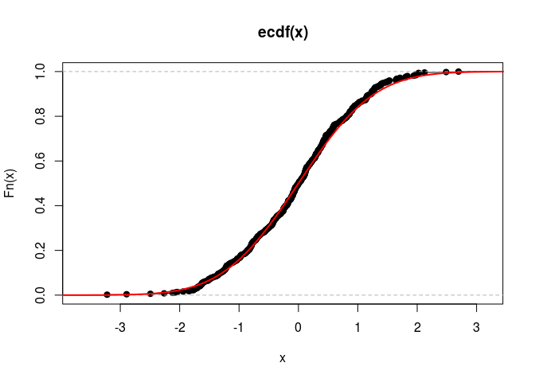
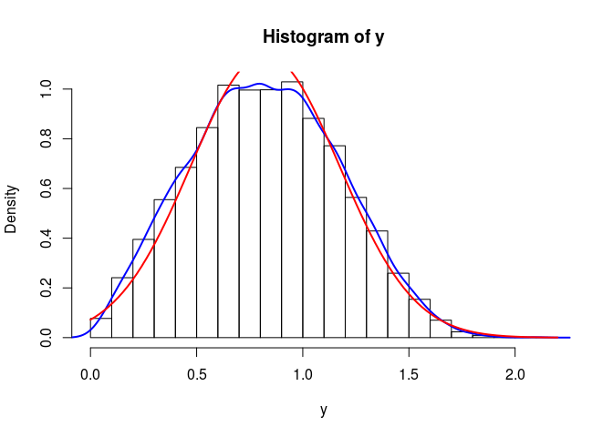
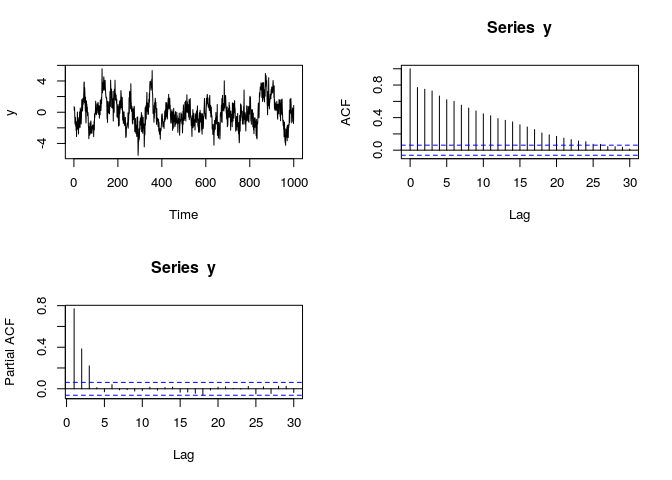

# Practical Econometrics 2
Vygantas Butkus  

Introductory Notes
====================================

This is not a textbook and it is not intend to be. 
Rather, it is short summary that emphases messages of lectures, 
gives corresponding references and reminds tasks (if any). 
During the course this note will be updated regularly.


### Students assesments

The final score are going to be estimated according a formula given below. 
Give your self a time to understand it: 


```r
round(sum(min(6, sum(tasks, midExam, extraPoints)), goldenPoints, finalExam))
```

The variables are explained in more details:

* `tasks`: during the course you are going to have quite a number of tasks. 
I believe this is the main part of the course. The maximum sum of points is 4, but
please note, that huge (unlimited) number of extra points can be received, 
if you demonstrate extra efforts in the tasks. In addition, please note that the `tasks` 
variable can be positive only if you supplied all the tasks that was required. 
If at least on of obligatory tasks are missing, the sum of total points are going to be 0.
Thus, do all the tasks, event if the deadline is far over.
* `midExam`: in the middle of semester you are going to have mid exam. The possible outcome is 2 points.
* `extraPoints`: extra points are going to serve as system of encouraging. You can get extra points in many situations: 
taking challenges, answering unexpected question in lecture, giving good question and so on. 
Please note, that `extraPoints` can be negative as well. This could happen in the case of cheating (or something).
* `goldenPoints`: golden points are very similar to extra points, but to get those, 
you will have to put extra efforts in it. How to get them will be steaded in course.
* `finalExam` after the semester you are going to have final exam. The total points of the exam is 4.

**Cultural aspects of the course:**

1. During the course students are encourage to collaborate with each other. 
You can freely share thought, ideas and event source codes. 
In addition students can use all the material that can be found in the Internet or textbooks.
Using the materials made by others are absolutely legal and have no negative side effect on your assesment.
But there are two conditions that are strictly mandatory:
  * You have to give all the credits to original source. 
  Please write an explicit note with links and give some comments. 
  * You have to make sure you understand all the details of the code (or ideas) that you are using. 
  You can be asked to comment it in great details. So, please use the material that you fully understand.


2. I am promise to do my best in answering all your question. You can ask freely during the lectures.
Nevertheless, in practical assignments, your tasks is to try to find the answer by your self. 
So, in practical tasks, before asking any question please be prepare to report that 
efforts you have made to get the answer?
For example: what has the Google query that you have used? That function you have already tried to apply?  


3. Reading and assessing other students rapports is an important part of your learning. 
Please be honest to your colleagues and give the best insights. On the other hand, 
you should appreciate all the criticism that you get and accept it as important part of your learning.

4. Any initiative and communication is highly encouraged. 
Thus, If you have any ideas how to make course more productive or interesting, please let me know. 

5. The tasks are always open for deeper analysis. If you
have idea how to reveal topic in more detail please do it - it probably will get you some extra points.
On the other hand, if you are not satisfied with the assignment that you get, 
you are free to give your reasons and negotiate. 
 

### Outline of the course

1. A short intro of the stuff that you already should know (at least most of it):
  * Technical tools: R (RStudio), Rmd files, Git
  * The basic properties and concepts  in statistics
  * Linear regression (with some extensions)

2. Linear regression in the content of time series
  * Basics (concepts, the difference with classical regression)
  * Trends (stochastic vs deterministic)
  * Spurious regression

3. Intro in time series
  * Basics: stationarity, autocorrelation, AIF, PAIF
  * The decomposition of time series 
  * Transformations    
  * Some common methods: exponential smoothing, moving average, filtering
  * Overview of more advanced methods: HP, Kalman, State Space

4. ARIMA model
  * AR(p)
  * MA(q)
  * RW
  * ARIMA: specification, diagnostic, estimation.
  
5. Overview of other important models:
  * Garch
  * logit

### Learning material

Selected textbooks that can be useful in this course could be found in [drobbox](https://dl.dropboxusercontent.com/u/106040112/literature.zip).
In addition, all references are given at the end o this document.


Moreover, some wonderful online material is available:

* Using R for Introductory Econometrics: http://www.urfie.net/ 
* Forecasting: principles and practice: https://www.otexts.org/fpp 
* Introduction to Probability, Statistics, and Random Processes: https://www.probabilitycourse.com/ 


Chapter 1. Technical tools
=====================================

## Technical requirements

In the course you are going to use tree main software:

* R - environment for statistical computing and graphics
* RStudio - a set of integrated tools designed to help you be more productive with R.
* Git - distributed version control system 


I assume you already know R and how to install it. If not check the links below:

* [Installing R on Windows](https://www.youtube.com/watch?v=mfGFv-iB724&feature=youtu.be)
* [Installing R on Mac](https://www.youtube.com/watch?v=Icawuhf0Yqo&feature=youtu.be)
* [Installing R on Ubuntu (linux) ](https://www.youtube.com/watch?v=P8wx4HY9me0)

In addition to R, it’s highly recommended that you install RStudio, 
which will make your experience with R much more enjoyable.
If you need to install RStudio, you can do so [here](https://www.rstudio.com/products/rstudio/download/).
Select the appropriate installer for your operating system.

Moreover, Git is also quite an important software. 
Git is a free and open source distributed version control system.
It helps you not to get lost in versions of your project. 
In addition it is much easier to merge contributions among 
all team members and always have the newest version of the project.
This is a system that professionals uses quite a lot (please admire it).
Please visit [Git home](https://git-scm.com/) and install it in your system.
Originally Git is command line program, on the other hand, Git might be used with
graphical interface (GUI). Visit [Gits guis page](https://git-scm.com/downloads/guis) 
to select the one that looks best for you.

## Tasks assessment guide

Šioje dalyje rasite nuorodas, kaip reikia vertinti savo kolegų darbūs.
Tam, kad vertinimai būtų suderinti, svarbu, kad jūs visi sektumėte šias nuorodas.
Vertinimo aspektai:

Baziniai aspektai: 

* Teisingumas. Esminiai klausimai:
    - Ar failas tikrai pasileidžia?
    - Ar užduotyje pateikta medžiaga ištiesų pilnai ir teisingai išsprendžia problemą?

* Programavimas:
    - Ar kodas yra tinkamai formatuotas ir išlygiuotas?
    - Ar kodas yra efektyvus ir logiškas?
    - Ar kodas gali būti patobūlintas, kad geriau atitktų bendresnius atvejus?
   
* Aiškumas:
    - Ar aišku kas ir kodėl daroma?
    - Ar sudėtingose vietose yra pateikti komentarai?
    - Ar aišku ką rodo grafikai?
    - Ar gaunamas rezultatas yra aiškiai pateiktas ir suprantamas?
    - Ar pateiktos nuorodos (jei tokių reikia)
   
Papildomi aspektai:

* Išbaigtumas. Išbaigtas darbas yra toks, kurį galėtų skaityti ir suprasti šio kurso neklausę žmonės.
  Turi būti įvadas, visi paaiškinimai, tinkamai parinkti grafikai ir t.t.

* Papildomos pastangos. Ar autorius pasistengė ir pateikė gilesnę analizę, negu buvo galima tikėtis iš užduoties?
  O gal techniškai labai gerai realizuotas - pavyzdžiui padaryta shiny aplikacija.
  
* Kiti niuansai. Gal darbas unikalus? Gal užduotis buvo neproporcingai sudėtinga?


## Task 1. Rmd in Github

The goal of your first task is to get familiar with R, Rmd files and Git. 

1. Firstly, you have to sign up for [Github account](https://github.com/) and then create a repository
under the name `Econometrics`. 

2. Go to the Google and find some awesome R features, packages, programs, graphs or something.
Pick anything that you think is worth noting. 

2. In `Econometrics` create a subdirectory `task1` and in this subdirectory
create Rmd file with title `task1.Rmd`. Then write a very short summary about the topic you have choose.
Please be polite and give the link to original material.
Try to put some R code snippets and visualization that describes the main essence of your note.
Try to customize something (if possible). And finally make sure that the file can be knited.

3. Commit it to Git and push to Github.
Please note, that RStudio has small GUI for Git. 
It is avalible if you create a project (insted of plain Rmd file).

4. Write an email to me (Vygantas.Butkus@mii.vu.lt) with subject "[PE2][task1] Link to Github".
And give the link to your Github account in the body.

Hint: A [short learning course on git](https://try.github.io/levels/1/challenges/1 could be useful.
Please try it if you are not familial with Git.

Please note that those who demonstrate the greatest quality in their task will have actual opportunity 
to get their first extra points. 

## Task 2. Swirl course

Please visit [swirl](http://swirlstats.com/) website. 
Swirl is a frameworks for interactive R learning.
Your task is to complete R programming course that can be find
in my [GitHub accaunt](https://github.com/1vbutkus/R_Programming).

For a first time, you have to install `swirl` package and the course material. 
Run R commands (be patient, this can take a while):

```r
install.packages('swirl')
library("swirl")
install_course_github("1vbutkus", "swirl", multi=TRUE)
```


To run a course you should type:

```r
library("swirl")
swirl()
```

Follow the instructions and select the "R Programming" course.
Course contains 12 lessons. You have to do all of them. After 
Finishing each lesson, system will generate an email that you have to send to 
vygantas.butkus@mii.vu.lt (with exact subject and body content that will be generated by swirl).

Please note, that there are other courses. They are optional and can be really
useful to increase knowledge and competition in R and data analysis. 
Please help your self.


**Alternative.**
This task have an alternative. If you consider your self being advanced enough in R, then
you can request a personal task. I believe this would be more interesting and more useful.
Contact me personally if you consider doing a personal task. 


Chapter 2. Probability and modeling
=====================================

Literature: the main source is [@Lavine2013a, ch. 1,2]. 
Alternative source is [@Kerns2011a, ch. 4-6, 10].


Key qualifications:

* understand main concepts of random variables (probability mass function, distribution function, quantile function, moments, covariance).
* know how to use R functions of random variables, ex: dnorm, pnorm, qnorm, rnorm
* how to use model custom variables of the forms $f(x)$, where $f$ is some known function, and
$x$ is some classical random variable.
* what is the principal of statistical tests?
* how to summarize modeling results and draw the conclusions.

Note: This chapter is about something that you already should know. 
So, please make sure you understand everything. If not, spend some time to catch up.

<!--
Paskaitos planas:

* Ankstenes paskaitos neišpildyti akcentai:
    * GIT iliustracija: status, add, commit, push, pull, clone, gitignore
* Atsitiktinių dydžių p,d,q,r funkcijos - teoriškai ir praktiškai.
* Mokomes generuoti dydžius pagal savo norus. Funkcija nuo atsitiktinių dydžių - taip pat atsitiktinis dydis! 
* Interaktyvus iššūkis
* R galimybės
* Statistiniai testai (esminis visuotinis principas). 
* Pasiūlymai užsidirbti:
    * Rulete - kai jau pamatai tendencija statyti priešingai. Hmm?
    * Ruletė - duble down strategija
-->

### Priminimas apie GIT

Svarbiausios proceduros: status, add, commit, push, pull, clone, gitignore.
Sukursime RProject ir pademonstruosime kaip dirbama.


### Random variables in R

R aplinkoje yra realiasuota labai daug atsitiktinių dydžių, žr. `?distributions`.
Pastebėkite, kad visi jie naudoja ta pačia pavadinimu schemą. Pirmosios raidės yra
`p`, `d`, `q`, ir `r`, o likusi dalis žymi skirstinio pavadinmą, pvz: `dnorm`, `pnorm`, `qnorm`, `rnorm`.


```r
# pazisiurekime p ir d sarysi: p = \int d
print("Skaiciai turi sutapti:")
integrate(dnorm, -Inf, 1)
pnorm(1)

# p ir q sarysis - tai vienas kitam prie6ingos funkcijos
print("Ar nustebsite, kad atsakymas bus 0.66?")
qnorm(pnorm(0.66))

# generavimas
print("O cia galiausiai generavimo pvz:")
x = rnorm(10000)
summary(x)
```

```
## [1] "Skaiciai turi sutapti:"
## 0.8413448 with absolute error < 1.5e-05
## [1] 0.8413447
## [1] "Ar nustebsite, kad atsakymas bus 0.66?"
## [1] 0.66
## [1] "O cia galiausiai generavimo pvz:"
##      Min.   1st Qu.    Median      Mean   3rd Qu.      Max. 
## -3.936000 -0.681500 -0.010680 -0.009881  0.681500  3.749000
```

Pasižiurėkime grafini skirstinio vertinimą:


```r
# sugeneruojame dydzius ir padrome grazu grafika palygonti teorija su praktika
x = rnorm(500)

# 1. histograma su branduoliniu tankiu ir palyginimu su teoriniu
hist(x, probability = TRUE)
lines(density(x), col=4, lwd=2)
curve(dnorm, lwd=2, col=2, add=TRUE)
```

 

```r
# 2. empyrine pasiskirskirstymo funkcija 
Fn <- ecdf(x)
plot(Fn)
curve(pnorm, -4, 4, add=TRUE, col=2, lwd=2)
```

 


### Custom random variables

Labai svarbus akcentas: funkcija nuo atsitiktinių dydžių - taip pat atsitiktinis dydis 
(su savo pasiskirstymo funkcija). p.s. šiame fakte slypi statistikos esmė.

#### Pvz. 1

Tegul $x \sim N(0,1)$ ir $y:= \sqrt{|x|}$. Kaip atrodo $y$ skirstinys? Koks vidurkis? Kam lygi tikimybė, kad $y < 1$? 

```r
# reneruojam x
x = rnorm(10000)

# tada y
y = sqrt(abs(x))

# galiausiai gauname grafika:
hist(y, probability = TRUE)
lines(density(y), col=4, lwd=2)
curve(dnorm(x, mean=mean(y), sd=sd(y)), lwd=2, col=2, add=TRUE)
```

 


```r
# kitos galimo isvados: mean, median, table (summary), density ir t.t.
summary(y)

# kokia tikimybe, kad y >1
mean(y>1)

# kokia tikimybe, kad kad y yra intervale [1, 1.5]
mean((1 <= y) & (y <=1.5))

# raskime 70% kvantili, t.y. toki x, kuriam galia lygybe: P(y<x)=0.7
quantile(y, 0.7)
```

```
##    Min. 1st Qu.  Median    Mean 3rd Qu.    Max. 
## 0.00753 0.55940 0.82240 0.82210 1.07100 2.09100 
## [1] 0.3165
## [1] 0.2938
##    70% 
## 1.0176
```


#### Pvz. 2

Du žaidėja ridena kauliukus. Pirmasis žaidėjas meta du klausiukus, o antrasis tris. 
Vertinama išmestų kauliukų suma. Laimi tas žaidėjas, kurio išmestu taškų suma yra didesnė. 
Jeigu iškrenta lygiosios, tai laimi pirmasis žaidėjas. Kokia tikimybė, kad laimės antrasis žaidėjas?


```r
# lets define the function that demonstrate dice roll
rollDice <- function(NDice){
  sum(sample(6, size=NDice, replace = TRUE))
}

# apply this function
rollDice(2) # pirmo zaidejo ekspermentas
rollDice(3) # antro zaidejo
rollDice(2) >= rollDice(3) # zaidimo ekspermentas

# apibrezkime ekspermento funkcija
experment <- function(){
  rollDice(2) >= rollDice(3) 
}

# lets find out the distribution of sum of two dices - abi uzklausos yra ekvivalencios
sim = replicate(10000, rollDice(2) >= rollDice(3))
sim = replicate(10000, experment())

# lets estimate the probability P(dice(3)=<dice(2))
mean(sim)
```

```
## [1] 7
## [1] 9
## [1] FALSE
## [1] 0.2255
```

#### Pvz. 3

Tegul $x_i \sim U(0,1), i={1,...,N}$. Stebėjimų vektorių pažymėkime $X$. 
Kaip atorodo aritmetinio vidurkio skirstinys? Griežtai kalbant mums reikia rasti funkcijos
$$f(X) = \frac{\sum x_i}{N} $$
skirstinį.

Išpradžių išsigrėžkimte, kaip atrodo $U(0,1)$ skirstinys

```r
# tai galima padaryti su specialia vfunkcija: curve(dunif, -1, 2)
# arba patiems realizuotifunkcija
x = seq(-1, 2, by=0.01)
y = dunif(x)
plot(x, y, type='l')
```

 

Paziurekime, kaip atrodo $F(X)$ skirstinys, kai $N=2$. Labai primenta trikampį (ištiesų taip ir turi būti).

```r
sim = replicate(100000, mean(runif(2)))
hist(sim, probability = TRUE)
lines(density(sim), col=4, lwd=2)
curve(dnorm(x, mean=mean(sim), sd=sd(sim)), lwd=2, col=2, add=TRUE)
```

 

Dabar pažiūrėkime, kaip atrodo $F(X)$ skirstinys, kai $N=100$ - turi daug labiau panašėti į normalujį.
Tai užtikrina CRT.

```r
sim = replicate(100000, mean(runif(100)))
hist(sim, probability = TRUE)
lines(density(sim), col=4, lwd=2)
curve(dnorm(x, mean=mean(sim), sd=sd(sim)), lwd=2, col=2, add=TRUE)
```

 

Kaip atrodo funkcijos 
$$ g(X) = \sqrt{N} (\bar{X} - 0.5 )$$
skirstinys? Čia $\bar{X}=f(X)$, t.y. $\bar{X}$ yra aritmetinis vidurkis.
Ar jo priklausomybė nuo $N$ tapo didesnė ar mažesnė?


```r
N = 50
sim = replicate(100000, sqrt(N)*(mean(runif(N))-0.5))
hist(sim, probability = TRUE)
lines(density(sim), col=4, lwd=2)
curve(dnorm(x, mean=mean(sim), sd=sd(sim)), lwd=2, col=2, add=TRUE)
```

 


#### Interaktyvus iššūkis

Reikia sukonstruoti MC modeliavimą, kurio pagalba galėtume įvertinti $\pi$ reikšmę, 
naudojant tik elemntarius veiksmus.

Mastymo vingiai:

1. Visų prima reikia susieti $\pi$ su kažkokių dydžiu, kurį galėtume vertinti.
Tam reikia turėti gerą intuiciją arba žinių arba patirtis. Kaip ten bebūtų viena 
iš geriausiai žinomų tiesioginių sąsajų yra apskritimo plotas, t.y. 
$$S = \pi r^2$$

Kadangi $r$ galime pasirinkti kokį modeliuoti, tai pasirenkame $r=1$ ir gauname, kad $S=\pi$.
Kitaip sakant $\pi$ radimas susiveda į ploto radimo uždavinį.

2. Kaip galime rasti plotą? Žinomo ploto kvadrate tolygiai skleisti atsitiktinius taškus.
Tuomet žiūrėti kiek jų yra apskritimo viduje. Šių taškų proporcija ir padeda iškaičiuoti atsakymą.

 

3. Kaip reikia generuoti dvimačius taškus ir gauti atsakymą? 
Kadangi taškai pagal abi kordinates yra nepriklausomos,
tai generavimas yra labai paprastas - atskirai generuojma $x$ ir atskirai $y$.
O galutinis atsakymas yra apskritimo vidinių taškų proporcija padauginti iš keturkampio ploto. Taigi

```r
N = 100000
x = runif(N, -1, 1)
y = runif(N, -1, 1)
mean(x^2 + y^2 <= 1) * 4
```

```
## [1] 3.14384
```

5. Kaip patikrinti konvergavimą? Galima žiūrėti, kaip keičiasi įvertis vis daugėjant stebėjimų.  


```r
N = 1000
x = runif(N, -1, 1)
y = runif(N, -1, 1)
sim = (x^2 + y^2 <= 1) * 4
cummean = cumsum(sim) / seq_along(sim)
plot(cummean, type="l")
abline(a=pi, b=0, col=3)
```

 

### R galimybių demonstracija

* Animacija
* Rcmdr ir grafika
* Shiny paketas


### Statistiniai testai

Visi statistiniai testai remiasi tuo pačiu principu.
Reikia turėti tokią funkciją,  kurios skirstinys būtų žinomas, kai galioja nulinė hipotezė.
Jei gauta funkcijos realizacija yra labai mažai tikėtina, tuomet hipotezės galiojimas kelia įtarimų.


```r
?t.test
?prop.test
?cor.test
?var.test

x = rnorm(100, mean=0)
t.test(x)
```

Panagrinėkime `t.test`. Įsitikinkite, kad mokate jį palesiti, suprantete atsakymą ir mokate padaryti išvadas.


```r
N = 100
x = rnorm(N, 0)
y = rnorm(N, 0.0)
t.test(x,y)
```

```
## 
## 	Welch Two Sample t-test
## 
## data:  x and y
## t = 1.5507, df = 196.34, p-value = 0.1226
## alternative hypothesis: true difference in means is not equal to 0
## 95 percent confidence interval:
##  -0.05609641  0.46893428
## sample estimates:
##   mean of x   mean of y 
## -0.02081068 -0.22722961
```

Kaip suprasti p-reiksmę. 
Patikrinikime p-reikšmės prasmė meliaviavimo principu.
Kas yra testo galia? Kaip ją galime paskaičiuoti?
Kokį skirstinį turi p-reikšmę?


## Task 3

Žemiau rasti užduotis. Kiekvienas studentas turi padaryti bent po dvi užduotis.
Jeigu studentas pasirenka daryti iššūkį, tai antros užduoties atlikti nereikia. 
Atliekant užduotis, reikia išnagrinėti pateiktus klausimus. Vien tik teisingas atsakymas netinka - 
reikia pateikti savo argumentus, rezultatus, iliustracijas ir kodo esminius fragmentus. 
Ką ir kokiu detalumu pateikti reikia nuspręsti jums patiems.
Siekiamybė yra pateikti tokią ataskaitą, kad statistikos pagrindus turintis žmogus galėtų
suprasti argumentus ir pasitikėti rezultatais.

Studentai gali laisvai rinktis kokias užduotis atlikti, 
bet labai skatinu studentus tarpusavyje pasiderinti, kad 
būtų atliktos visos užduotys. Išreikšdamas šį skatinimą pasižadu šiuos skatinimus:

* Labai apsimoka daryti užduotį, kurios niekas nenori. Kuo mažiau žmonių daro tą pačią užduotį, 
tuo didesnė tikimybė gauti papildomus taškus. Jeigu būsi vienintelis atlikęs užduotį, 
tai papildomi taškai tampa praktiškai užtikrinti. 

* Apsimoka daryti daugiau negu privalomas minimumas. Jeigu kokybiškai atliksite daugiau nei privaloma, tai
gausite papildomų taškų.

* Jeigu bendrai per visus studentus bus realizuotos visos užduotys, tai visi visuotinai gausite papildomų taškų.

* Jeigu šalia visų užduočių taip pat bus **kokybiškai** realizuoti ir visi iššūkiai, 
tai visuotinai gaunami taškai bus padvigubinti.


Šiai užduočiai sukurite subdirektorija `task3`. Jos viduje kiekvienai pasirinktai užduočiai 
taip pat po direktorija - pagal užduoties pavadinima. 


**Kauliukai.** Pirmasis žaidėjas meta vieną kauliuką ir fiksuojamas atsivertusių taškų skaičius.
Antrasis žaidėjas meta du klausiukus ir fiksuojamas dydis:
$\max(x_1, x_2)-1$,  kur $x_1$ ir $x_2$ žymi pirmojo ir antrojo kauliukų iškritusių akių skaičių.
Jeigu žaidėjų gautų taškų skaičiai yra lygus, tai ekspermentas kartojamas iš naujo 
(ir taip kartojama tol, kol galiausiai nustatomas laimėtojas). Kokia tikimybė laimėti pirmajam žaidėjui?


**Moneta.** Tarkime metama moneta. Jeigu iškrenta herbas, tai laimite $12$ EUR. 
Jeigu skaičius, tai pralošiate $10$ EUR.
Bus žaidžiama $n$ kartų ir gauti rezultatai sumuojami. Kokia tikimybė jums turėti teigiamą
balansą po $n$ kartų? Kokis išlošių pasikliautiniai $95%$ intervalai.
Ištirkite tikimybes su skirtingais $n$, pvz. $n={1,2,5,10,20,100}$.
Kaip atrodo balanso tankis? Kai $n=100$.


**Rulete.** Nagrin4kime standartinę kazino ruletę. 
Kokia tikimybė po $1000$ vienodų statymų ant vienos pasirinktos spalvos, bus teigiamas balansas?
Raskite apytikslę $x$ reikšmę, kuriai galioja nelygybe $P(balansas<x) = 0.25$.


**CRT.** Generuojame $n$ atsitiktinių dydžių turinčių Beta skirstinį su parametrais 
$\alpha=\beta=0.5$ Iš šių atsitiktinių dydžių suskaičiuojamas aritmetinis vidurkis.
Kaip atrodo vidurkio tankis, kai $n=100$? 


**TeorijaVsPraktika.** Ridename $4$ klauliukus. 
Suskaičiuokite jų teorinį skirstini ir patikrinkite jį su empiriniu skirstiniu gautu Monte Carlo metodu.


**Laimikis.** (Įššūkis) Žvejys žvejoja kiekviena darbo dieną. Ir taip jau stabiliai tęsiasi $5$ metus.
Vidutiniškai žmogus pagauna 20 žuvų per dieną. Tarkime, kad žuvų kiekio skirstinį gerai aprašo Poisono 
atsitiktinis dydis. Žuvų dydį gerai nusako normalusis atsitiktinis dydis.
Pagaunamų žuvų dydžio pasikliautinis 90% intervalas yra [180, 750] (gramų). 
Pabandykite įvertinti kokį didžiausią laimikį yra pagavęs žvejys. Koks Jūsų įverčio pasikliautinis intervalas?

**Futbolas.** (Įššūkis) Modeliuokime fotbolo varžymų metu įmašumų įvarčių kiekį. 
Laiko intervalai tarp įvarčių modeliuojami su eksponentiniu skirstiniu 
(eksponentinio skirstinio parametrą pasiūlykite patys). 
Kaip tuomet atrodo įvarčių pasiskirstymas varžybų tėkmėje?
Taip pat pažiūrėkite kokį skirstinį turi varžymų bagties skirstinys. 
Ar tai primena Poisono skirstinį? Ar galite tlikti formalų testą?


**LengvasUzdarbis** (Įššūkis) Kazino ruletės išsami analizė. 
Internete yra daug puslapių siūlančių greitai ir užtikrintai užsidirbti.
Pvz: http://gerasuzdarbis.biz/l1/
Šiame puslapyje pateikta lošimo strategija, kuri anot autoriaus garantuoja išlošimą. 
Jums reikia kaip profesionalui išsiaiškinti strategiją ir patikrinti jos veikimą. Taip pat 
patikrinti ką teigia puslaio autorius ir rasti ką jis nutyli. 


**Trikampis** (Įššūkis) Fraktalo generavimas. 
Kartais atsitiktinumas sugeneruoja labai neatsitiktines struktūras.
Pvz: https://en.wikipedia.org/wiki/Sierpinski_triangle 
Padarykite R gražia aplikaciją, kurioje būtų vizualiai realizuotas
Sierpinskio trikampio generavimas **Chaos game** principu.


Chapter 3. Tiesinė regresija
=====================================================

Literature: the main source is [@Kerns2011a, ch. 11, 12]. 
Alternative source is [@Lavine2013a, ch. 3].

Key qualifications:

* Know and understand the linear model in both representations (in equation and matrix forms)
* Run linear regresion and make proper conclusions form regresion output
* Make sure regresion is correctlly applied
* Know how to apply transformations and dummy variables

Visa reikiama medžiaga yra literatūroje - ji yra pagrindinė šios temos mokymosi medžiaga.

**Akcentas nr. 1** Tiesinė lygties specifikacija ir jos matricinė forma yra ekvivalenčios formos, 
aprašančios tą patį modelį. 
Lygties forma yra patogesnė galvojimui, interpretavimui ir diskusijomis.
Tuo tarpu matricinė forma daug patogesnė skaičiavimams ir techniniam argumentavimui. 
Jūs turite mokėti suprasti abi formas.

**Akcentas nr. 2** $\beta$ yra nežinomo konstanta (arba matrica). 
Nors ji ir nežinoma, bet visgi konstanta - t.y.
ji neturi savo skirstinio ir nuo nieko nepriklauso. Tuo tarpu $\hat{\beta}$ yra $\beta$-os 
įvertinys, gaunama iš duomenų. Kadangi tai funkcija nuo duomenų - tai $\hat{\beta}$ yra ne konstanta, 
o atsitiktinis dydis. Taigi $\hat{\beta}$ turi savo skirstinį, 
kuris savo ruožtu proklauso nuo stebėjimų skaičiaus ir duomenų tarpusavio priklausomybės.
Taigi $\beta$ ir $\hat{\beta}$ labai skirtingi objektai!

**Akcentas nr. 3** Įvertinimo metudų yra daug. Pagrindiniai metodai yra šie:
  
  * mažiausių kvadratų; 
  * didžiausio tikėtinumo;
  * momentų metodas. 

Klasikinės tiesinės regresijos atveju, jie visi sutampa. 
Taigi kolkas galime į jų skirtumus perdaug nesigilinti,
bet bendruoju atveju reikia turėti omenyje, kad egzistuoja skirtingi metodai - 
jų metodologija ir teorija taip pat skirtingos.


**Akcentas nr. 4** Pagrindinės OLS įverčių savybės:

* Nepaslinkumas: $E\hat{\beta}=\beta$
* suderinamumas: $lim_{n\rightarrow\infty}\hat{\beta}_n=\beta$

Ar esate tikri ką šios savybės reiškia?

**Akcentas nr. 5** Gauti įverčius yra lengvoji analizės dalis dalis. 


```r
# library('car')
# generuojame duomenis
N = 100
x = rnorm(N, mean=2)
y = 2 -3*x^2 + rnorm(N)

# tiesines regresijos iverciu radimas
lmFit = lm(y~x)
lmFitSumm = summary(lmFit)
lmFitSumm
```

```
## 
## Call:
## lm(formula = y ~ x)
## 
## Residuals:
##      Min       1Q   Median       3Q      Max 
## -16.9914  -1.5773   0.8406   3.0125   5.1476 
## 
## Coefficients:
##             Estimate Std. Error t value Pr(>|t|)    
## (Intercept)  11.2723     0.8819   12.78   <2e-16 ***
## x           -12.2392     0.3843  -31.85   <2e-16 ***
## ---
## Signif. codes:  0 '***' 0.001 '**' 0.01 '*' 0.05 '.' 0.1 ' ' 1
## 
## Residual standard error: 4.004 on 98 degrees of freedom
## Multiple R-squared:  0.9119,	Adjusted R-squared:  0.911 
## F-statistic:  1014 on 1 and 98 DF,  p-value: < 2.2e-16
```

Užtikrinkite, kad suprantate visus stanartinės išvesties skaičius.
Taip pat žinokite, kad šiuos skaičius galite tiesiogiai pasiekti ir naudoti teikste, pvz.
šos regresios $R^2$ yra 0.9119.

**Akcentas nr. 6** Turint modelį reikia užtikrinti, kad modelis geras ir nepasireiškė galimos blogybės.
Pagrindinės problemos:

* netiesiškumas
* išskirtys (žr. `influence.measures`, `outlierTest`)
* multikolinerumas (žr.`vif`)
* heteroskedastiškumas (žr. `ncvTest`)
* autokoreliacija (žr. `durbinWatsonTest`)

Galingiausias pradinės analizės  įrankia - tai grafikai 
(žr. `?plot.lm`, taip galim konstruoti ir savo grafikus, 
pvz. labai svarubs prognozės ir faktiniu duomenų sklaidos diagrama).
O turint įtarimų juos galima patikrinti ir formliais testais.

**Akcentas nr. 7** Kitos pasabos:

* Prognozės ir interpretavimo skirtumai
* Fiktyvūs kintamieji
* *Overfit* problema

## Task 4

Aplanke `task4` yra duomenų failas, kuriame rasite nekilnojamo turto (o tiksliau gyvenaųjų būtų) 
kainas ir kaikurias jų charakteristikas.
Jūsų užduotis atlikti išsamią tiesinę regresiją. 
Lygtis reikalinga prekyboms agentams, 
kad geriau suprastų kokią
įtaką skirtingos charakteristikos daro galutinei kainai.

Chapter 4. Laiko eilučių įvadas (tiesinės regresijos kontekste)
================================================================

Klasikinė tiesinė regresija vienmačiu atvjeu)
$$y_i = \beta_0 + \beta_1 x_{i} + \varepsilon_i,$$

kur $\beta_j,j=0,1$ yra nežinomos kostantos, o $x_{i}$ yra žinomi egzogeniniai kintamieji.
Tariama, kad $x_{i}$ neatsitiktiniai dydžiai.
Taip pat tariama, kad $x_{i}$ tvarka neturi prasmės.

Laiko eilučių tiesinės regresijos lygtis galėtų atrodyti taip
$$y_t = \beta_0 + \beta_1 x_{t} + \varepsilon_t,$$
Turiu vilties, kad visi skaitytojai pastebės mažą skirtumą ir puikiai supras, kad
šis skirtumas visiškai nekeičia esmės. 

Taigi, kuo skiriasi laiko eilučių regresija? Skirtumas didžiulis!
Skirtumas yra ne lygtyje, o prielaidose. Dabar ir tvarka svargi ir $x_t$ gali būti atsitiktiniai dydžiai.

Taigi dydžiai $x_{t}$ ir $x_{t-1}$ gali būti priklausomi (dažniausiai taip ir yra). 
Maža to dydis $x_{t-1}$ gali būti naudingas prognozuojant $y_t$.
Taigi galima nagrinėi tokią regresiją
$$y_t = \beta_0 + \beta_1 x_{t} + \beta_2 x_{t-1} + \varepsilon_t,$$
Maža to, tokių vėluojančių kintamųjų skaičius gali būti kiek norimai didelis.

Dar daugiau. Gali paaiškėti, kad $y_{t-1}$ taip pat naudingas prognozuojant $y_t$.
Taigi, tokia regresija taip pat prasminga
$$y_t = \beta_0 + \beta_1 x_{t} + \beta_2 x_{t-1} + \beta_3 y_{t-1} + \varepsilon_t,$$

Taigi iš paprastos (gal net nuobodžios) regresijos, galima sukurti labai daug skirtingų variacijų.
Šis skirtumas praturtina mūsų analizės galimybes, bet turi rimtų pasekmių, bet tam, kad jas
suprasti, reikės naujų teorinių sąvokų.

### Gerų atvejų pavyzdžiai

Kaip jau minėta - regresijos lygtis laiko eilučių atveju nieko nesiskiria nuo klasikinio atveju.
Taigi viską ką išmokote tiesinės regresijos atveju, galima iškarto naudoti - tereikia mokėti pastumti eilutes.
Šiam tikslui yra paketų (pvz. `dynlm`), bet galima apsieiti ir be jų.


```r
# postumio funkcija
L <- function(x, lag=1){
  c(rep(NA,lag) , x[1:(length(x)-lag)])  
}
x = 1:10
x
L(x, 2)
```

```
##  [1]  1  2  3  4  5  6  7  8  9 10
##  [1] NA NA  1  2  3  4  5  6  7  8
```


**Pvz.1** Tiesinės regresijos pvz, kuomet $y$ priklauso nuo pavėlintų savo reikšmių.

```r
eps = rnorm(1000)
y = filter(eps, filter=0.666, method = "recursive")
```

Pasižiūrėkim kaip atrodo $y$.

```r
plot(y, type="l", xlab="t", ylab="y")
```

 

Nelabai aiški priklausomybė, ar ne? Bet norint aiškiau tai parodyti, galime išbrėžti kaip atrodo 
priklausomybė tarp $y_t$ ir $y_{t-1}$. Pasižiūrėkime:

```r
plot(L(y), y, xlab="t(t-1)", ylab="y")
```

 

Taip pat galime paskaičiuoti ir koreliaciją

```r
cor(L(y), y, use="pairwise.complete.obs")
```

```
## [1] 0.6133633
```

Galiausiai galime gauti įverčius

```r
summary(lm(y~ I(L(y))))
```

```
## 
## Call:
## lm(formula = y ~ I(L(y)))
## 
## Residuals:
##     Min      1Q  Median      3Q     Max 
## -3.4270 -0.6976 -0.0051  0.6917  2.9487 
## 
## Coefficients:
##             Estimate Std. Error t value Pr(>|t|)    
## (Intercept)  0.02224    0.03238   0.687    0.492    
## I(L(y))      0.61422    0.02505  24.522   <2e-16 ***
## ---
## Signif. codes:  0 '***' 0.001 '**' 0.01 '*' 0.05 '.' 0.1 ' ' 1
## 
## Residual standard error: 1.022 on 997 degrees of freedom
##   (1 observation deleted due to missingness)
## Multiple R-squared:  0.3762,	Adjusted R-squared:  0.3756 
## F-statistic: 601.3 on 1 and 997 DF,  p-value: < 2.2e-16
```

**Pvz.2** Tiesinės regresijos pvz, kuomet $x$ yra pavėlintas.

```r
x = rnorm(1000)
y = 1 + 0.7*x + 0.3*L(x) + rnorm(1000)
summary(lm(y~x + I(L(x))))
```

```
## 
## Call:
## lm(formula = y ~ x + I(L(x)))
## 
## Residuals:
##     Min      1Q  Median      3Q     Max 
## -4.1013 -0.6807  0.0431  0.7245  2.6638 
## 
## Coefficients:
##             Estimate Std. Error t value Pr(>|t|)    
## (Intercept)  0.96783    0.03168  30.551   <2e-16 ***
## x            0.73289    0.02978  24.607   <2e-16 ***
## I(L(x))      0.26983    0.02984   9.042   <2e-16 ***
## ---
## Signif. codes:  0 '***' 0.001 '**' 0.01 '*' 0.05 '.' 0.1 ' ' 1
## 
## Residual standard error: 1.001 on 996 degrees of freedom
##   (1 observation deleted due to missingness)
## Multiple R-squared:  0.4075,	Adjusted R-squared:  0.4063 
## F-statistic: 342.5 on 2 and 996 DF,  p-value: < 2.2e-16
```

**Pvz.3** Tiesinės regresijos pvz, kuomet $y$ vėlinys naudojamas kaip regresorius.

```r
x = rnorm(1000)
xInfl = 3*x  + rnorm(1000)
y = filter(xInfl, filter=0.666, method = "recursive")
summary(lm(y ~ x + I(L(y))))
```

```
## 
## Call:
## lm(formula = y ~ x + I(L(y)))
## 
## Residuals:
##     Min      1Q  Median      3Q     Max 
## -2.8525 -0.6713 -0.0064  0.6261  3.2241 
## 
## Coefficients:
##             Estimate Std. Error t value Pr(>|t|)    
## (Intercept) 0.025063   0.031099   0.806     0.42    
## x           3.026315   0.031927  94.788   <2e-16 ***
## I(L(y))     0.664998   0.007407  89.777   <2e-16 ***
## ---
## Signif. codes:  0 '***' 0.001 '**' 0.01 '*' 0.05 '.' 0.1 ' ' 1
## 
## Residual standard error: 0.9826 on 996 degrees of freedom
##   (1 observation deleted due to missingness)
## Multiple R-squared:  0.9454,	Adjusted R-squared:  0.9453 
## F-statistic:  8623 on 2 and 996 DF,  p-value: < 2.2e-16
```

#### Problematika

Šiame skyriuje praktiškai pademosntruosime, kuomet iškyla problemos. Pvz, kokių koeficientų galima tikėtis
tiesinėje regresijoje 
$$y_t = \beta_0 + \beta_1 x_t + \varepsilon_t,$$
kuomet $x$ ir $y$ yra sugeneruoti pagal kodą, kuris pateiktas žemiau.

```r
x = rnorm(100, mean = 1)
y = rnorm(100, mean = 2)
```

Turbut lengva atspėti

```r
library(knitr)
out = lm(y~x)
kable(summary(out)$coef, digits=2)
```

               Estimate   Std. Error   t value   Pr(>|t|)
------------  ---------  -----------  --------  ---------
(Intercept)        2.17         0.13     17.00       0.00
x                 -0.12         0.09     -1.33       0.19


O kas jeigu šiek tiek pakeisime $x$ ir $y$ generavimą?

```r
x = cumsum(rnorm(100, mean = 1))
y = cumsum(rnorm(100, mean = 2))
kable(summary(lm(y~x))$coef, digits=2)
```

               Estimate   Std. Error   t value   Pr(>|t|)
------------  ---------  -----------  --------  ---------
(Intercept)       14.97         1.37     10.91          0
x                  2.01         0.03     72.95          0

Kodėl? ...


>  Apibendrinimas: TiesiogiaitTiesinę regresiją laiko eilutėms prasminga naudoti tik dviems atvejais:
>
>  * Laiko eilutės yra stacionarios. 
>  * Laiko eilučių procesai yra kointegruoti. 

Suprantu, kad nei vienas terminas dar nėra apibrėžtas - tam reikės bent kelių paskaitų. 
Svarbu, kad prisimintumėte, kad tiesinė regresija su laiko eilutėmis yra pilnai suderinti, bet rekia
rūpintis papildomomis savybėmis. Jei laiko eilutės nėra nei stacionarios, nei kointegruotos, tai reikia 
kažkaip jas transformuoti, kad atsirastų stacionarumas. 


### Greiti sprendimai

Ką daryti, jei yra priežasčių nerimauti?
Vis dar nesigilinant į laiko eilučių teoriją, galima pateikti du dažniausiai papilitusius 
metodus :

 * Trendų ar sezoniškumo komponentės įtraukimas į regresijos lygtį;
 * Skirtumų naudojimas.
 
Šie metodai neužtikrina sekmės, bet stipriai sumažina akivaidžių klaidų tikimybę.
Pabandykime sugeneruoti kelias iliustracijas.

Tam, kad išsamiai atsakyti ką ir kada taikyti jau reikia gilintis giliau. Apie tai kitame skyriuje. 

## Užduotys

Šios savaitės pirmoji užduotis yra sutvarkyti ankstenes užduotis, taip kad jos atitiktų
naujai iškeltus reikalavimus.

### Task 5

**Pinigų paklausa.** Šioje užduotyje reikia atlikti tiesinę regresiją.
Pakete `dynlm` yra duomenų masyvas `M1Germany` - ten yra ir jo aprašymas.
Iš turimų duomenų sudarykite ir įvertinkite tiesinę regresiją, kurios endogeninis kintamasis yra `logm1`.
Lygtis būtų naudojama prognozuoti pinigų kiekį artimiausiam laikotarpiui į prieki remiantis dabartine situacija.
Taigi prognozės sudarymui lygtis gali naudoti tik tuos duomenis, kurie būtų žinomi prognozavimo momentu.

### Challange 1

**Iššūkis1.** Google organziuoja progromavimo varžybas. 
Dalyvauti gali visi norintys ir naudoti gali viską ką sugeba. 
[Tikiuosi, kad ką nors sudomins](https://code.google.com/codejam/). 
Noriu pasiūlyti iššukį iš vienos užduoties: 
[Rope Intranet.](https://code.google.com/codejam/contest/619102/dashboard)
Jeigu padarysite R funkciją, kuri gauna teisingą atsakymą (dideliam masyvui) - 
tai gausite papildomų taškų. Maža to, jei jūsų programa savo greičiu aplenks mano parašytą funkciją, tai
pipildomi taškai taps auksiniais taškais. 
Užduotį reikia atlikti individualiai ir savarankiškai, taip pat reikia mokėti ją paaiškinti.


Chapter 5. Laiko eilučių įvadas
================================================================

Literatūra: Laiko eilučių pagrindinis šaltinis [@Hyndman2014a] - taip išliks visą šį kursą.
Papildomas šaltinis [@Leipus2010a] - tai daug labiau teoretinis šaltinis, norint griežtai suprasti sąvokas.
Kiti šaltiniai taip pat geri ir naudingi - bet jie pasidaro naudingesni, kai jums bus aiški esmė.


### Sąvokos

Čia ne visos sąvokos, bet tikrai tos, kurias būtina žinoti ir prisiminti (bent jau iki studijų baigimo).

**Kovariacinė funkcija.** Atsitiktinio proceso ${X_t , t \in T}$, su visais $t \in T$
tenkinančio sąlygą $DX_t < \infty$ kovariacinė funkcija apibrėžiama lygybe
$$r(s, t) = Cov(X s , X_t ) = E(X_s − EX_s )(X_t − EX_t ),$$
kai $s, t \in T$.

**Stacionarumas (plačiąja prasme).** Seka ${X_t ,t \in Z}$  vadinama stacionaria, (plačiąja prasme) jeigu:

1) $\forall t \in Z: E|X_t |^2 < \infty$,
2) $\forall t \in Z: EX_t = EX_0$ ,
3) $r(s, t) = r(s + h, t + h)$ su visais $s, t, h \in Z$.

**Stacionarumas (siaurąja prasme).**
Seka ${X_t , t \in Z}$ vadinama stacionariąja siaurąja (arba
griežtąja) prasme, jeigu su visais $k \in N  t_1, t_2 , ..., t_k$ ir $h \in Z$ vektorių
$(X_{t_1} , ..., X_{t_k} )$ ir $(X_{t_1 + h} , ..., X_{t_k+h})$ pasiskirstymai sutampa.

Nesunku matyti, jeigu seka ${X_t}$ yra stacionari siaurąja prasme ir
$E|X_t|^2 < \infty$ , tai ji yra stacionari ir plačiąja prasme. Atvirkščias gi teiginys
nėra teisingas.

Kadangi stacionariai sekai tesinga $r(s, t) = r(s − t, 0)$ su visais $s, t \in Z$,
tai patogiau kovariacinę funkciją traktuoti kaip vieno argumento funkciją ir
rašyti tiesiog $r(s) = r(s, 0)$ visiems $s \in Z$.
Stacionarios sekos koreliacinė funkcija apibrėžiama lygybe
$$\rho(h) = r(h)/r(0)$$
su $h \in Z$.

**Postūmio operatorius.** Operatorius $B$ yra postūmio operatorius, t.y. galioja lygybė
$$B X_t = X_{t−1}.$$ 

Šį operatorių galime taikyti kelis kartus ,t.y. $B^2 X_t = B(B X_t)=B X_{t-1} = X_{t-2}$.
Taigi bendruoju atveju galioja lygybė
$$B^j X_t = X_{t−j},$$ 
kur  $j \in Z$.

**Skirtumo operatorius.** Operatorius $\nabla$ yra skirtuminis operatorius, t.y. galioja lygybė
$$\nabla X_t = X_{t} - X_{t-1} = (1-B)X_t.$$ 

Jį taip pat galima taikytis kelis kartus, t.y. 
$$\nabla^2 X_t = \nabla \nabla  X_t = \nabla(X_{t} - X_{t-1}) = \nabla X_{t} - \nabla X_{t-1} = 
(X_{t} - X_{t-1}) - (X_{t-1} - X_{t-2}) =  X_{t} - 2 X_{t-1} + X_{t-2}.$$ 

Bendruoju atvjeu galioja lygybė
$$\nabla^j X_t = (1-B)^j X_t,$$
kur $j \in N$. 

Taip pat galima apibendrinti skirtumo operaturių, kuomet skirtumas skiačiuojamas per $j$ žingsnių, t.y.
$$\nabla_j = X_{t} - X_{t-j}.$$

**Dalinė autokoreliacija.** Tegul ${X_t, t \in Z}$ yra stacionari seka. 
Dalinė autokovariacia žymi koreliaciją tarp $X_t$ ir $X_{t-k}$ yra koreliacija tarp kintamųjų,  
kuomet eliminuojama tarpinių narių $X_{t-1}, ..., X_{t-k+1}$ įtaka.
Išsamesnis paaiškinimas yra [@Leipus2010a, ch. 7.3] (o šiame kurse kolkas užteks ir intuityvaus suvokimo.)


**Baltas triukšmas.** Seka ${Z_t}$ vadinama balto triukšmo seka su vidurkiu $0$
ir dispersija $\sigma^2$ , jeigu $EZ_t = 0$, $r(0)=\sigma^2$ ir $r(h)=0$, kai $h>0$.
Žymėsime  $t \sim BT (0, \sigma^2 )$.

## Užduotys

### Task 6

Šaltinyje [@Hyndman2014a, ch. 1. Introduction to forecasting, Lab Session 1] Yra dvi užduotys.
Jums reikia padaryti vieną (galite laisvai pasirinkti kurią). 
Kaip visada užduoties rezultatas turi būti tvarkingas Rmd failas. 
Šalia grafikų būtinai pateikite savo komentarus.


### Task 7

Šaltinyje [@Hyndman2014a, ch. 2. The forecaster’s toolbox, Lab Session 2] Yra penkios užduotys.
Jums reikia padaryti tris (galite laisvai pasirinkti kurias). 
Kaip visada užduoties rezultatas turi būti tvarkingas Rmd failas. 
Šalia grafikų būtinai pateikite savo komentarus.


### Task 8

Jums reikės skaityti savo kolegų darbus ir juos vertinti.
Kiekvienam reikės įvertinti penkis savo kurso draugus.
Priskirti asmenys yra mano github paskyroje esančiame faile studentai.xlsx darbalapyje "Vertinimų paskirstymas".
Jums reikia perskaityti visų paskirtų asmenų visas atlikas užduotis.
Tuomet kiekvienai užduočiai reikės užpildyti 
[klausimyną](https://docs.google.com/forms/d/1W-LLoYvT9YbhyGetV2BNqDcA7KwZzOCeHwwWp8g7m38/viewform?c=0&w=1).
Rekomenduoju nepildyti klausimyno iš karto, visų pirma perskaitykite užduotis, palyginkite kokybę, o kai jau turėsite nuomonę - tuomet užpildykite klausimyną.
Skaitykite ir vertinkite atsakingai. 
Jeigu kolega padarė klaidų ir jūs to nepastebėjote, tai dabar šios klaidos tapo ir Jūsų klaidomis.

### Task 9

Analogiškai kaip `Task 8` turie patikrinti savo paties darbą.
Darbą turite įvertinti taip lyg tai būtų kito žmogaus darbas - t.y. surašyti komentarus ir pastabas.
Galbūt dabar jau kitaip darytumėte savo darbą - galbūt jau patys matote savo klaidas.
Šis vertinimas yra būdas garbingai tai deklaruoti ir pademonstruoti savo kompetencijos padidėjimą.
Vertinimą reikia atlikti iki balandžio 11 d. 23:59.


Chapter 5. Esponentinis glodinimas
================================================================

Literatura [@Hyndman2014a, ch. 3.]

Eksponentinio glodinimo esmė yra glodinimas (kaip netikėta :)). O kas yra glodinimas? 
Pažiūrėkime, kaip tai atrodo:


```r
y = cumsum(rnorm(300))
plot(y, type="l", main="eksponentinis glodinimas")

alpha = 0.5
l1 = filter(y*alpha, f=1-alpha,method = "recursive")
lines(l1, col=2)


alpha = 0.2
l1 = filter(y*alpha, f=1-alpha,method = "recursive")
lines(l1, col=3)


alpha = 0.1
l1 = filter(y*alpha, f=1-alpha,method = "recursive")
lines(l1, col=4)
```

 

Problemos lygiai tokios pačios kaip betkuriame ekonometriniame vertinima:

  1. Kaip pasirinkti parametrus?
  2. Kaip patikrinti tinkamumą?
  3. Jei yra trūkumų ar galima juos minimizuoti?

### Task 10

Šaltinyje [@Hyndman2014a, ch. 3., Lab Session 3] reikai atlikti 1. ir 2. užduotis. 
Užduotyse prašo espermentuoti su parametrais ir modeliais - mokymosi metu ekspermentuokite tiek kiek reikia, kad 
suprastumėte esmę, o į ataskitą dėkti 3-4 įdomiausius atvejus. Jūs patys turite atrinkti kokie atvjejai įdomisi.
Būtinai pakomentuokite, kokią žinutę šie tvjeai perteikia.
Kaip visada užduoties rezultatas turi būti tvarkingas Rmd failas. 
Šalia grafikų būtinai pateikite savo komentarus.
Užduotį reikia atlikti iki balandžio 19 d. 23:59.

### Task 11

Šaltinyje [@Hyndman2014a, ch. 3., Lab Session 4] reikai atlikti pirmą užduotį. Kaip visada užduoties rezultatas turi būti tvarkingas Rmd failas. 
Šalia grafikų būtinai pateikite savo komentarus.
Užduotį reikia atlikti iki balandžio 19 d. 23:59.

Chapter 6. Time series cross-validation
================================================================

### Task 12
Šaltinyje [@Hyndman2014a, ch. 5., Lab Session 5b] reikai atlikti pirmą užduotį. Kaip visada užduoties rezultatas turi būti tvarkingas Rmd failas. Užduotį reikia atlikti iki balandžio 26 d. 23:59.


Chapter 7. Making time series stationary
================================================================

### Task 13
Šaltinyje [@Hyndman2014a, ch. 6., Lab Session 6] reikai atlikti pirmas tris užduotis užduotis. Kaip visada užduoties rezultatas turi būti tvarkingas Rmd failas. Užduotį reikia atlikti iki balandžio 26 d. 23:59.


Chapter 8. ARIMA
================================================================


```r
L <- function(x, lag=1){
  c(rep(NA,lag) , x[1:(length(x)-lag)])  
}

eps = rnorm(1000)
y = filter(eps, filter=c(0.4, 0.3, 0.2), method = "recursive")
plot(y, type="l")
```

 

```r
acf(y)
```

 

```r
pacf(y)
```

 

```r
fitlm = lm(y~L(y,1)+L(y,2)+L(y,3))
summary(fitlm)
```

```
## 
## Call:
## lm(formula = y ~ L(y, 1) + L(y, 2) + L(y, 3))
## 
## Residuals:
##     Min      1Q  Median      3Q     Max 
## -3.2304 -0.6704 -0.0013  0.6402  3.4185 
## 
## Coefficients:
##             Estimate Std. Error t value Pr(>|t|)    
## (Intercept) -0.03700    0.03316  -1.116    0.265    
## L(y, 1)      0.40816    0.03095  13.186  < 2e-16 ***
## L(y, 2)      0.25948    0.03254   7.976 4.16e-15 ***
## L(y, 3)      0.22193    0.03098   7.163 1.54e-12 ***
## ---
## Signif. codes:  0 '***' 0.001 '**' 0.01 '*' 0.05 '.' 0.1 ' ' 1
## 
## Residual standard error: 1.021 on 993 degrees of freedom
##   (3 observations deleted due to missingness)
## Multiple R-squared:  0.6693,	Adjusted R-squared:  0.6683 
## F-statistic: 669.9 on 3 and 993 DF,  p-value: < 2.2e-16
```


References
============================================================
---
references:
- id: Kerns2011a
  title: Introduction to Probability and Statistics Using R
  author:
  - family: Kerns
    given: G. Jay
  issued:
    year: 2011
    
- id: Lavine2013a
  title: Introduction to Statistical Thought
  author:
  - family: Lavine
    given: Michael
  issued:
    year: 2013

- id: Leipus2010a
  title: Finansinės laiko eilutės
  author:
  - family: Leipus
    given: Remigijus
  issued:
    year: 2010
    
- id: Hyndman2014a
  title: Forecasting - Principles and Practice
  author:
  - family: Hyndman
    given: Rob J
  issued:
    year: 2014
---

